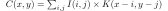
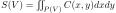
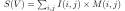
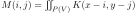
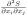
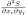
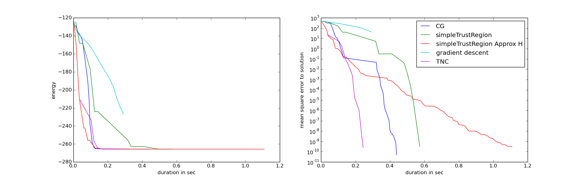

# Project's goals

The goal of this project is to provide an easy-to-install python library to  compute the **exact integral** of an interpolated image within a polygon and its **exact 1rst and 2nd order derivatives** with respect to the location of the polygon vertices.
It also provides as a by-product the possibility to draw the image of a **filled polygon with exact analytical anti-aliasing** with a rectangular box kernel (a.k.a unweighted area sampling) and bilinear interpolation kernel.

The  details on the maths and their exact implementations are in my PhD thesis [1] [pdf](https://tel.archives-ouvertes.fr/tel-00619637/document) in section 3.5 and in the annexe p199-204. 

**Note**: This code also allows to draw polygons with exact prefilter antialising. If your goal is only to perform antialiasing you could use the c++ code accompanying the paper 4]( without python bindings). You can also get good antialiasing (exact?) using [aggdraw](https://pypi.python.org/pypi/aggdraw/1.1-20051010)

# Installation

using pip

on linux

	sudo pip install git+git://github.com/martinResearch/PolygonalRegionIntegrals

on windows

	pip install install git+git://github.com/martinResearch/PolygonalRegionIntegrals

# Mathematical specification of the computed integral and its derivatives

Given a discrete image *I* that takes known values at discreate pixel location we defined the interpoled image *C* to be : 

with *K* an interpolation kernel that depends on the type of interpolation we use (nearest neighboor or bilinar)
*C* is define in the continuous domaine 

A polygon is defined by a list of N vertices defined by a vector of length 2N ![latex:V=[x_1,y_1,\dots,x_N,y_N]](./images/eqnV.svg)
We denote by *S(V)* the set of points inside the polygon in the continuous domain

The integral of the interpolated image within the polygon writes

 

interestingly by simply permuting the integral and the sum used in the definition of C, we obtain 

With M the antialised image of the polygon defined by 

  
Our code provides S(V),M and also the  gradient (1rst order derivatives) 

![latex:\left[\frac{\partial S}{\partial x_1}, \frac{\partial S}{\partial y_1},\dots,\frac{\partial S}{\partial x_N},\frac{\partial S}{\partial y_N}\right]](./images/eqnSderiv1.svg),

 and the second order derivatives 

       and      

in the form of a sparse Hessian matrix (it is zero when abs(i-j)>1 ie for vertices that are not directly adjacent in the polygon).

# Examples 

Once installed examples can be found in 

	/usr/local/lib/python2.7/dist-packages/polygonintegrals/examples

If that is not the case you find where polygonintegrals has been installed from python using

	import polygonintegrals
	print polygonintegrals.path

you can launch an example directly from within python using a simple import, for example

	from  polygonintegrals.examples.activePolygon import test
	test()
	import polygonintegrals.examples.test

you can get the list of examples as follows :

	import polygonintegrals.examples
	print polygonintegrals.examples.list

## Active regions with explicit polygonal boundaries

The computation of an integral in a polygon and its derivatives can be used to easily implement efficient image segmentation method based on polygonal representation of the contour with terms involving integrals of images inside the polygon. having the exact integrals and their exact gradients and Hessian is useful to be able to obtain good convergence rates.

An example of active polygon can be launched using 

	from  polygonintegrals.examples.activePolygon import test
	test()

You should see the active polygon at intialization (blue) and convergence (yellow)

as well as the curves  showing convergence rates of different optimization methods (left: energy, right: mean squared distance to the solution)

## Drawing antialiased polygons

you can draw antialiased polygons using the function drawAntialiasedPolygon

	import numpy as np
	from polygonintegrals.antialiasedPolygon import drawAntialiasedPolygon
	import matplotlib.pylab as plt

	im=np.zeros((60,60,3))    
	poly=np.array([[10,10],[50,31.5],[14,50]])
	drawAntialiasedPolygon(im,poly, [1,0,0], 'bilinear')
	plt.imshow(im,interpolation='none')
	plt.show()

# TODO

* re-implement the simple approximation of the gradient of the integral given in page 117 of [1] and compare in term of convergence rates. Maybe write a gradient descent method that does not need to evaluate the energy itself (step length based on the gradient angles and fixed size steps ? )
* use a better shape prior : maybe a kind of *as rigid as possible* energy given a reference shape (would be useful for tracking)
* use this library to implement *Information-Theoretic Active Polygons for Unsupervised Texture Segmentation*[2] and *active polygons for object tracking* [3]
* define a new method that computes the integral of the square of the image within the polygon
* make that function able to take two input : the image , and an affine function ax+by+c in order to integrate the square of the difference  within the polygon
* eventually get code for the gradient and hessian of the integral with respect to the vertices  but also with respect to the parameters a ,b and c of the affine function, assuming the image is interpolated bilinearly.
* add the bicubic interpolation case when the integral is done on the boundary of the polygon (function integreOnSegments), and cythonize it. This will allow to add a boundary term in the active polygon.
* add functions to perform polygon clipping and hidden surface removal and provide the jacobian matrix that contains the derivative of the output polygon vertices with respect to the input polygons. Maybe reimplement the method explained in [5]. could reuse some code from [here](https://github.com/helderco/univ-polyclip/blob/python/polygon.py) or translat in python the c++ code from [here](http://davis.wpi.edu/~matt/courses/clipping/code.html)

# License

Free BSD.

# Citations

If you use any part of this work please cite the following:

Section 3.5 from *Model-based 3D Hand Pose Estimation from Monocular Video*. M. de la Gorce PHD Ecole Centrale Paris 2009 [pdf](https://tel.archives-ouvertes.fr/tel-00619637/)

	@phdthesis{lagorce:tel-00619637,
	  TITLE = {{Model-based 3D hand pose estimation from monocular video}},
	  AUTHOR = {La Gorce, Martin de De la Gorce},
	  URL = {https://tel.archives-ouvertes.fr/tel-00619637},
	  NUMBER = {2009ECAP0045},
	  SCHOOL = {{Ecole Centrale Paris}},
	  YEAR = {2009},
	  MONTH = Dec,
	  TYPE = {Theses},
	  PDF = {https://tel.archives-ouvertes.fr/tel-00619637/file/Thesis_delagorce_arch.pdf},
	  HAL_ID = {tel-00619637},
	  HAL_VERSION = {v1},
	}

# References

[1] Martin de La Gorce *Model-based 3D hand pose estimation from monocular video* PhD Ecole Centrale de Paris 2009 [pdf](https://tel.archives-ouvertes.fr/tel-00619637/document)

[2] Gozde Unal, Anthony Yezzi and Hamid Krim *Information-Theoretic Active Polygons for Unsupervised Texture Segmentation* IJCV 2014. [pdf](http://lccv.ece.gatech.edu/docs/ijcv_Information_Theoretic_Active_Polygons.pdf) 

[3] Gozde Unal, Hamid Krim and Anthony Yezzi *Active Polygons for Object Tracking*. In IEEE 1st Int. Conf. 3D Data Processing and Visualization and Transmission 2002. [pdf](http://citeseerx.ist.psu.edu/viewdoc/summary?doi=10.1.1.18.2576)

[4] Josiah Manson and Scott Schaefer *Analytic Rasterization of Curves with Polynomial Filters* Computer Graphics Forum (Proceedings of Eurographics) 2013
[pdf](http://faculty.cs.tamu.edu/schaefer/research/scanline.pdf) [code](http://josiahmanson.com/research/scanline_rasterization/)

[5] *Analytic Visibility on the GPU* Thomas Auzinger, Michael Wimmer, Stefan Jeschke Computer Graphics Forum 2013. [pdf](https://www.cg.tuwien.ac.at/research/publications/2013/Auzinger_2013_AnaVis/Auzinger_2013_AnaVis-Paper.pdf)